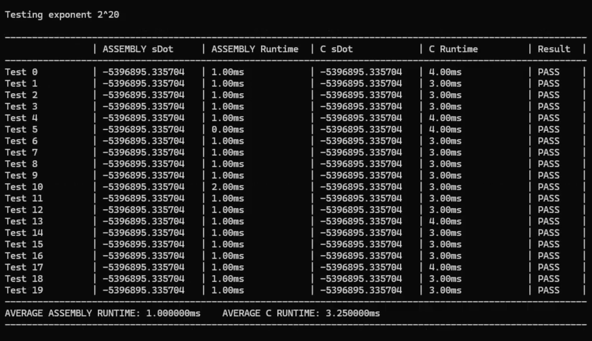
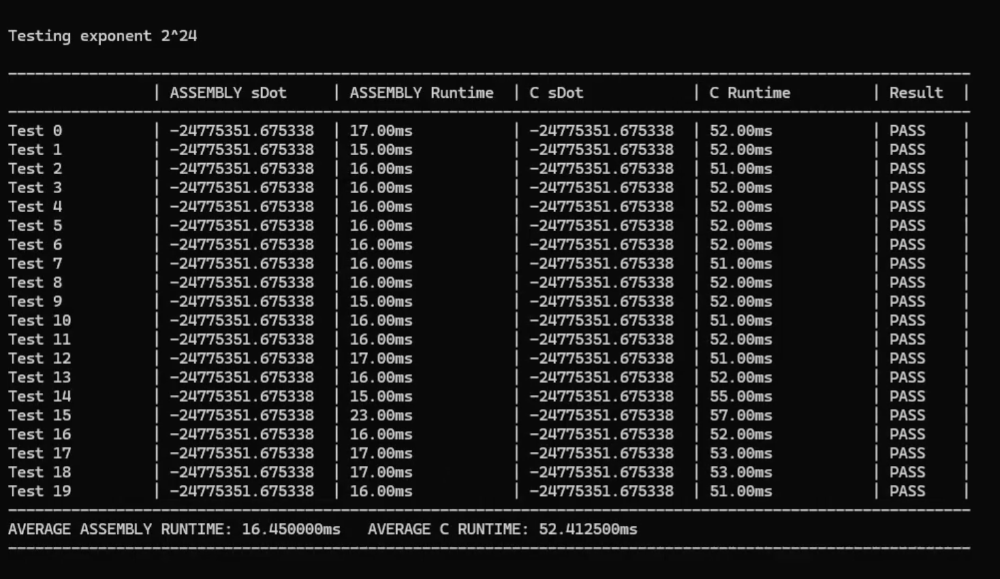
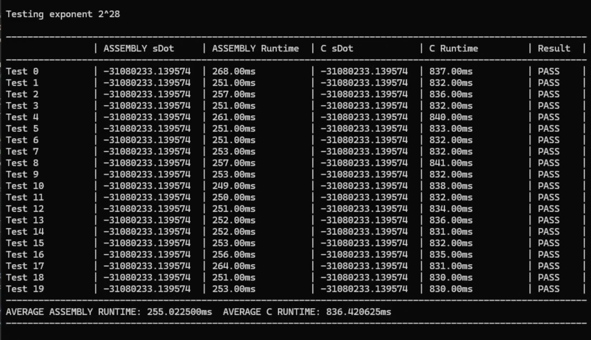
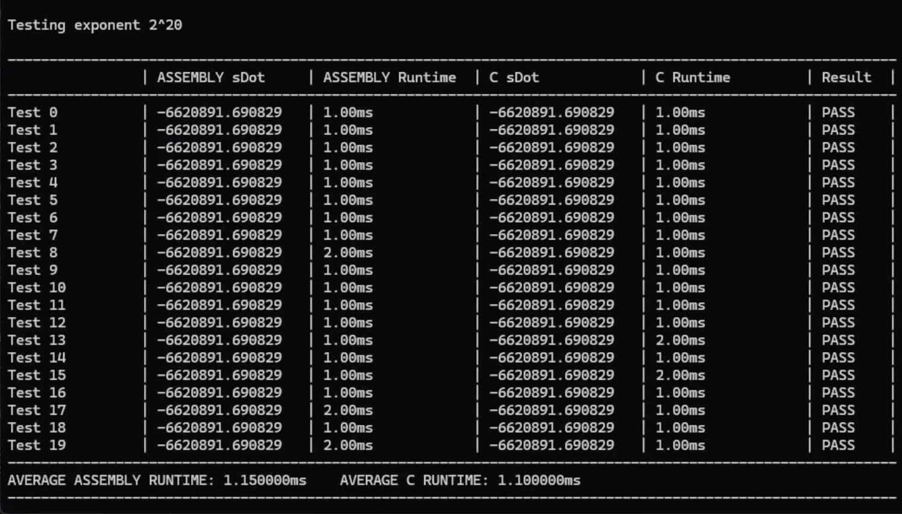
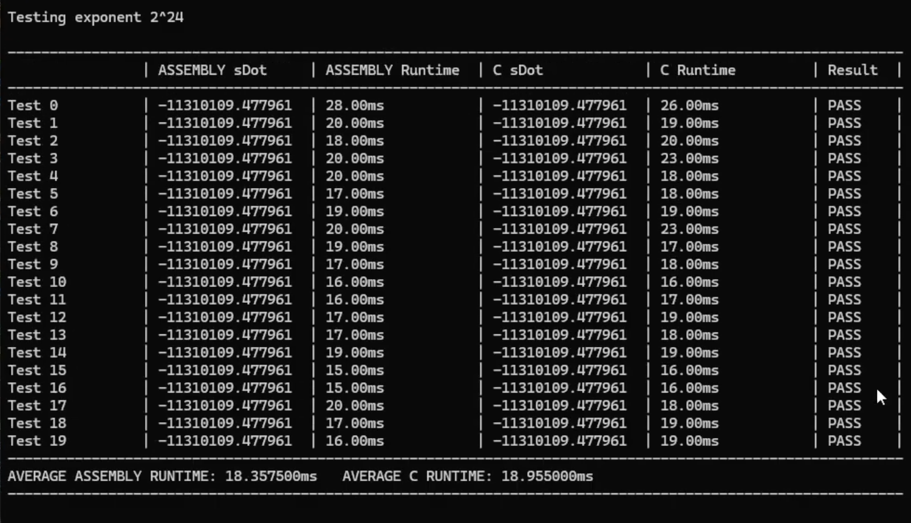
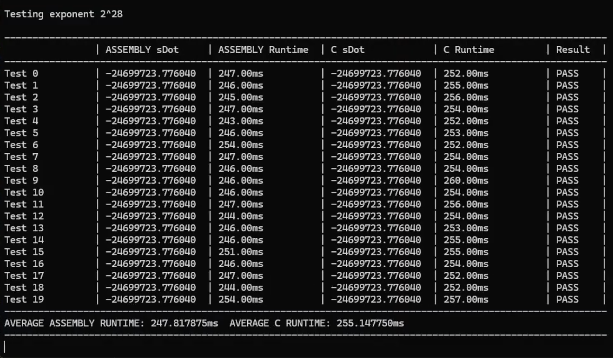

# Comparison of Execution Times

### Comparative Execution Time

The table below summarizes the average execution times of 20 test runs for vector sizes $n = 2^{20}$, $2^{24}$, and $2^{28}$:

| VECTOR SIZE (n) | ASSEMBLY DEBUG | C DEBUG | ASSEMBLY RELEASE | C RELEASE |
| --- | --- | --- | --- | --- |
| $2^{20}$ | 1.00ms | 3.25ms | 1.15ms | 1.10ms |
| $2^{24}$ | 16.45ms | 52.41ms | 18.36ms | 18.96ms |
| $2^{28}$ | 255.02ms | 836.42ms | 247.82ms | 255.15ms |

# Analysis

Based on what can be observed in the average execution times, we first noticed that the Debug build of Assembly is significantly faster than C's, with the tests using vector sizes of $2^{20}$ being ~3.25x faster, $2^{24}$ being ~3.19x faster, and $2^{28}$ being ~3.28x faster. In Debug build mode, the C compiler doesn't optimize speed and uses diagnostic checks to ensure traceability during development. It avoids reorganizing instructions so that each state could be inspected at that specific point, relying on stack memory, which slows execution; while Assembly utilizes CPU registers more than memory, reducing the need for memory accesses.

The execution times of C in Release build mode vary slightly to those of Assembly with a difference of a few milliseconds. Release mode utilizes optimizations and allows C to store and compute commonly used variables in registers, eliminating the need to frequently access the memory, explaining why execution times between C (in Release) and Assembly are very similar. 

Lastly, we compare the execution times of the C and Assembly kernels. In Assembly, the execution speed is consistent between Debug and Release, regardless of the build use. However, in C, the Debug execution time is approximately 3x slower than that of Release, making it less stable compared to that of Assembly. 

# Screenshots for Correctness Check

### Debug Build ($2^{20}$, $2^{24}$, and $2^{28}$)

### Release Build ($2^{20}$, $2^{24}$, and $2^{28}$)

# Video

